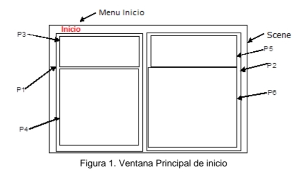

# Documentación Interfaz Gráfica Python

- Generalidades
    
    - Tipos de objetos por prefijo:

        - bt -> Button
        - fr -> Frame
        - img -> Image
        - lbl -> Label
        - ent -> Entry
        - mnu -> Menu

## Contenido por ventanas

### Ventana de inicio



La ventana de inicio está compuesta por los siguientes elementos, en la jerarquia dada:

- 1. Scene
    - 1.1. menu mnuInicio
        - 1.1.1. menu mnuDescripción
        - 1.1.2. menu mnuSalir
    - 1.2. frame frP1
        - 1.2.1. frame frP3
             - 1.2.1.1. label lblSaludo
        - 1.2.2. frame frP4
             - 1.2.2.1. image imgSistema
             - 1.2.2.2. button btVentanaPrincipal
    - 1.3. frame frP2 

        **Vista 1** (Inicial)
        - 1.3.1. frame frP5
            - 1.3.1.1. label lblHV (Hoja de vida)
        - 1.3.2. frame frP6
            - 1.3.2.1. image imgHV1
            - 1.3.2.2. image imgHV2
            - 1.3.2.3. image imgHV3
            - 1.3.2.4. image imgHV4

        **Vista 2** (Ejecutada por el menú descripción)
        - 1.3.1. label lblDescripciónSistema

---

### 1. Scene

Contenido: mnuInicio, frP1 y frP2.

#### Medidas y ubicación de los elementos

**Nota**: Medidas relativas dadas respecto al Scene.

- mnuInicio
    - Medidas: No aplica
    - Ubicación: Parte superior

- frP1
    - Medidas: W 50 x H 100
    - Ubicacion:Parte inferior izquierda 

- frP2
    - Medidas: W 50 x H 100
    - Ubicacion: Parte inferior derecha 

#### Bosquejo

```python
# +---------------+
# | mnuInicio |   |
# +---------------+
# |       |       |
# | frP1  |  frP2 |
# |       |       |
# +---------------+
```
---
### 1.1. Menu mnuInicio

Contenido:  mnuDescripción, mnuSalir.

#### Medidas y ubicación

**Nota**: No aplica medidas, sólo ubicación relativa respecto al mnuInicio

- mnuDescripción
    - Ubicación: Primer item de la cascada

- mnuSalir
    - Ubicacion: Segundo item de la cascada

#### Bosquejo

```python
# +--------------------------+
# | | mnuInicio |            |
# |    > | mnuDescripción | |
# |    > |mnuSalir |         |
# +--------------------------+
```

#### 1.1.1. Menu mnuDescripción

- Label: Descripción

- Command: función descripcionP2()

```python
def descripciónP2():
    # Esta función deberá retirar los hijos que tenga el frame frP2, y cambiarlo por un Label con la descripción del sistema.
```
**Nota:** El mensaje con el que se actualizará P2 se puede ver en 1.3.1.


#### 1.1.2. Menu mnuSalir

- Label: Salir

- Command: función Salir()

```python
# Sale del loop de ejecución de la GUI

def Salir():
    destroy()
```

---

### 1.2. frame frP1

Contenido: frame frP3, frame frP4.

#### Medidas y ubicación

**Nota**: Medidas relativas dadas respecto al frame frP1.

- frP3
    - Medidas: W 100 x H 30
    - Ubicación: Parte superior

- frP4
    - Medidas: W 100 x 70
    - Ubicacion:Parte inferior. 

#### Bosquejo

```python
# +---------------+
# |     frP3      |
# |               |
# +---------------+
# |               |
# |     frP4      |
# |               |
# +---------------+
```

---

### 1.2.1. frame frP3

Contenido: label lblSaludo.

- Medidas y ubicación: W 100 x H 100, centro (respecto al frame frP3)

#### 1.2.1.1. label Saludo

Contenido: ¡Bienvenido a Wunallet! Si deseas acceder a las funcionalidades por favor da click en ir a ventana principal. 
A la derecha puede encontrar información sobre los desarrolladores, y para ver una breve descripción del software puedes ir a la
ruta Inicio -> Descripción.

---

### 1.2.2. frame frP4

Contenido: image Imagen y button btVentanaPrincipal.

#### Medidas y ubicación

**Nota**: Medidas relativas dadas respecto al frame frP4.

- image imgSistema
    - Medidas: W 100 x H 70
    - Ubicación: Parte superior

- button btVentanaPrincipal
    - Medidas: W 100 x H 30
    - Ubicacion:Parte inferior. 

#### Bosquejo

```python
# +------------------------+
# |                        |
# |        Imagen          |
# |                        |
# +------------------------+
# |   btVentanaPrincipal   |
# |                        |
# +------------------------+
```

#### 1.2.2.1. image imgSistema

- Contenido: Imagen relacionada con la aplicación (también pueden ser imágenes relacionadas al concepto de la aplicación simplemente). Deben ser 5 imágenes en total.

- Comportamiento: Cada vez que el mouse 'entre' al área de la imagen se debe pasar a la siguiente imagen (un cambio por cada 
ingreso del mouse) (son 5 imágenes), por lo tanto se debe hacer un loop que itere como un rollo por las cinco imágenes. 

Más información sobre cómo hacer esto se puede encontrar [aquí](https://stackoverflow.com/questions/49888623/tkinter-hovering-over-button-color-change).


#### 1.2.2.2. button btVentanaPrincipal

- Label: Ventana Principal

- Command: función goToVentanaPrincipal()

```python
# Esta función debe abrir la ventana principal y cerrar la ventana de inicio.

def goToVentanaPrincipal():
    ...
```
---

### 1.3. frame frP2

### Vista 1 (Vista base)

Contenido: frame frP5, frame frP6.


#### Medidas y ubicación

**Nota**: Medidas relativas dadas respecto al frame frP2.

- frP5
    - Medidas: W 100 x H 30
    - Ubicación: Parte superior

- frP6
    - Medidas: W 100 x 70
    - Ubicacion:Parte inferior. 

#### Bosquejo

```python
# +---------------+
# |     frP5      |
# |               |
# +---------------+
# |               |
# |     frP6      |
# |               |
# +---------------+
```
---

### 1.3.1. frame frP5

Contenido: label lblHV.

- Medidas y ubicación: W 100 x H 100, centro (respecto al frame frP5)

#### 1.3.1.1. label lblHV

Contenido: Presentación breve de cada desarrollador.
    
    Plantilla base: "<Nombre estudiante> es un estudiante de <nombre carrera>, tiene <XX> años y en sus tiempos libres le gusta <actividades favoritas>. Programa en <lista de lenguajes> pero su lenguaje favorito es <lenguaje favorito>.

Comportamiento: Cada vez que se de click sobre el área que abarca el label, se debe cambiar la descripción del desarrollador. 
Adicionalmente cuando se ejecute la acción de cambio de descripción se debe cambiar las 4 imagenes que hay en el frame frP6,
de forma que la descripción y las imágenes siempre estén sincronizadas al mismo desarrollador.

Más información sobre cómo hacer esto se puede encontrar [aquí](https://stackoverflow.com/questions/49888623/tkinter-hovering-over-button-color-change).

---

### 1.3.2. frame frP6

Contenido: imagen imgHV1, imagen imgHV2, imagen imgHV3, imagen imgHV4.

#### Medidas y ubicación

**Nota**: Medidas y ubicaciones relativas dadas respecto al frame frP6.
**Nota**: Este frame debe ordenarse mediante un administrador de esquema Grid()

- imgHV1
    - Medidas: W 50 x H 50
    - Ubicación: row=0, column=0 

- imgHV2
    - Medidas: W 50 x H 50
    - Ubicación: row=0, column=1

- imgHV1
    - Medidas: W 50 x H 50
    - Ubicación: row=1, column=0

- imgHV1
    - Medidas: W 50 x H 50
    - Ubicación: row=1, column=1

#### Bosquejo

```python
# +---------------+
# |       |       |
# |  iHV1 |  iHV2 |
# |       |       |
# +---------------+
# |       |       |
# |  iHV3 |  iHV4 |
# |       |       |
# +---------------+
```

#### 1.3.2.1. imagen imgHVX

Contenido: Foto o imagen relacionada a cada desarrollador.
    
Comportamiento: Ver (1.3.1.1. label lblHV) para saber el comportamiento que debe tener el conjunto de imágenes en relación con los
clicks de dicho label.
Este comportamiento se logra retirando en cada click, cada widget hijo que tiene el frame frP6. Luego se toman las imágenes
del siguiente desarrollador y se añaden al frame. 

```python
def cambiar_fotosHV(frame, lista_direcciones):
    clearFrame(frame) #Retira los hijos que tiene el frame
    for i in lista_direcciones:
        # crea Y posiciona el widget label/image que va a contener la imagen. Lista de direcciones es una lista de rutas 
        # relativas a las fotos de cada desarrollador, ej: lista_Diego = [./foto1, ./foto2,...] (se debe adaptar la sintaxis)

#Nota: Esta función debe llamarse cada vez que se ejecute la función escuchadora de los clicks en el label del 1.3.1.1.
```

        **Vista 2** (Ejecutada por el menú descripción)
        - 1.3.1. label lblDescripciónSistema
--- 

### Vista 2 (Ejecutada por el menú descripción)

Contenido: label lblDescripciónSistema.

#### Medidas y ubicación

**Nota**: Medidas relativas dadas respecto al frame frP2.

- Medidas: W 100 x H 100

#### Bosquejo

```python
# +---------------+
# |               |
# |               |
# +  lblDescSist  +
# |               |
# |               |
# |               |
# +---------------+
```
### 1.3.1. label lblDescripciónSistema

Contenido: Wunallet es un software bancario centrado en facilitar al usuario que realice operaciones interbancarias. Nuestras funcionalidades incluyen: Transferencias, solicitudes de crédito, ver el historial de transacciones en tu cuenta, romper los topes de tus cuentas de bajo monto e inscribir cuenta.
